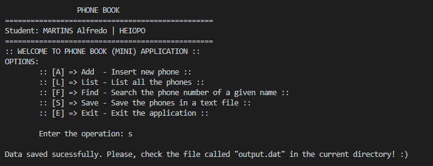

# PHONE BOOK

1. Create a phone book application. A phone book can store a list of (name, phone number) pairs.

2. Represent an entry with a struct of a name and a phone number. The name and the phone number should both be 30 character arrays.

3. Represent a phone book with a structure that contains a pointer to an array of entries, the number of inserted elements and the actual size of the array.

4. Create an `init()` function which initializes the phone book. This function has an integer parameter which determines the size of the entries' array. An array with this size should be allocated on the heap memory. Don't forget to implement a corresponding destroy() in order to avoid memory leak.

5. Create an `insert()` function which is given a name and a phone number. These should be inserted to the phone book. If the name is already in the phone book then the person's phone number should be updated. The insert() function should return a boolean value depending on whether the insertion was successful. The insertion is not successful if the array is full.

6. Create a `get()` function which is given a name and returns the phone number of this person. If the person is not found in the phone book then NULL pointer should return.

7. Create a `print()` function which prints all entries of the phone book.

8. Create a `dump()` function which prints all entries to a text file. The text file's name should be given as a parameter to this function.

In the `main()` function demonstrate the usage of all functions. Create a phone book, insert a few entries and print its content to the screen and a text file.

___

`Make sure to avoid any undefined behavior in the program. In case of compilation error, the assignment automatically scores 0 points.`
___

## Instructions
Run the following commands in the linux terminal line according to your desire:

1. Random inputs:
    ```
    gcc main.c phonebook.c util.c && ./a.out
    ```
2. Manually entered inputs:
    ```
    gcc main.c phonebook.c util.c && ./a.out manually
    ```
    or
    ```
    gcc main.c phonebook.c util.c && ./a.out -m
    ```
3. To check memory leaks, try:
    ```
    gcc main.c phonebook.c util.c -fsanitize=undefined -g && ./a.out
    ```
    or
    ```
    gcc main.c phonebook.c util.c -fsanitize=undefined -g && ./a.out -m
    ```
___
## Screenshots

### Run in random mode
1. Single screen <br>
   

2. Outputfile<br>
   
    <br>
### Run manually
1. Main screen and insertion <br>
   
    <br>
2. Insertion <br>
   
    <br>
3. List 
    <br>
   
    <br>
4. Save
    <br>
   
    <br>
5. Dismiss
    <br>
   
    <br>

> Solved by: MARTINS Alfredo